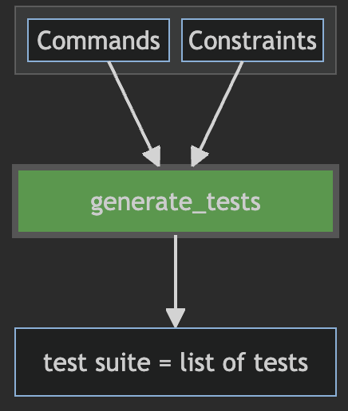

# fuzz

**Version**: 2.1.2

## Introduction

This repository contains a library `fuzz` for fuzz testing
flight software. The main function, `generate_tests`, provided by the library, generates a test suite,
which is a list of tests. Each test is a list of commands (a named data record), which can be sent
to the flight software, referred to as the _System Under Test_ (SUT), from a FIT script. Each test is randomly generated, optionally
restricted by user provided constraints written in an expressive temporal logic.
The objective of fuzzing is to invoke unlikely, untried, command sequences on the flight
software in an attempt to break it.

The function `generate_tests` takes as input a description of possible commands in XML format,
including a description of what particular flight software modules should be tested (areas),
and a specification of constraints (which can be empty), which limits the amount of randomness,
allowing to avoid unrealistic command sequences or to focus on specific command sequences of interest. 
It returns a _test suite_ (a list of tests), generated using a constraint 
solver ([z3](https://github.com/Z3Prover/z3)).

<p align="center">
  
</p>

A generated test suite is a list of tests, each being a list of commands,
each being represented as  a dictionary containing the name of the command and any arguments.
Here this is shown in schematic form with _m_ tests with _n_ commands in each test.

```
test_suite =
  [
    [cmd_11, cmd_12, ...,cmd_1n], <--- test number 1 containing n commands
    [cmd_21, cmd_22, ...,cmd_2n], <--- test number 2 containing n commands
  
    [cmd_m1, cmd_m2, ...,cmd_mn], <--- test number m containing n commands
  ]
```

Below is an example of a generated test suite consisting of two tests, each containing three commands.
The name of the command is denoted by `"name"`, and the rest of the fields in a command are the arguments,
in the order in which they must be provided (it is an ordered dictionary).

```python
[
    [
        {
            "name": "DDM_ENABLE_DWN_PB_EXIT_GATE",
            "dwn_framing_packet_buffer": "DIAGNOSTIC_EVR",
            "enable_disable": "ENABLE"
        },
        {
            "name": "GNC_SRU_SET_EXT_OH_REF_FRAME",
            "which_sru_eu": "NON_PRIME_SRU_EU",
            "which_sru_oh": "BOTH"
        },
        {
            "name": "GNC_SRU_READ_DIAG_DATA",
            "which_sru_eu": "SRU_EU_B"
        }
    ],
    [
        {
            "name": "DDM_CLOSE_OPEN_CONT_DP"
        },
        {
            "name": "DDM_DEL_DP",
            "apid": 268,
            "time_type": "DVT",
            "filter_time_start": 2262188308,
            "filter_time_end": 1622977556,
            "sent_status": "ALL"
        },
        {
            "name": "DDM_ENABLE_DWN_PB_EXIT_GATE",
            "dwn_framing_packet_buffer": "REALTIME_EHA_4",
            "enable_disable": "ENABLE"
        }
    ]
]
```

The approach is very general and can in principle be applied to any software that is driven by commands.
Note that the system **currently** does not check whether the SUT behaves correctly since there is no
verification of output from the SUT. The sole purpose is to break the SUT. Output verification will be
added in a later version of the system.

## Installation

### Prerequisites

- Python 3.11 or higher installed on your system.

### Obtain the Project

Clone or copy the fuzzing project to your local machine (cloning done in `HTTPS` mode):

```
git clone https://github.jpl.nasa.gov/lars/fuzzing.git
```

This will create a folder `fuzzing` with the project.

There are now two different ways to install it.

### Installation Using `pip install`

Execute the following commands:

1. Enter the directory: `cd fuzzing`
2. If virtual env has not been created already: `python -m venv venv`
3. Active the virtual environment:
   - if using bash, zshrc, or sh shell: `source venv/bin/activate`
   - else if using csh or tcsh shell: `source venv/bin/activate.csh`
4. Install fuzz: `pip install .`

This will install `fuzz` with all its dependencies.

To test this:

```
cd tests/demo2
python fit.py
```

This should print out two generated tests, to be explained in detail below.


### Alternative Installation Using the `PYTHONPATH`

Set the PYTHONPATH environment variable to include the path to fuzzing:

```bash
export PYTHONPATH=/path/to/fuzzing:$PYTHONPATH
```

Then install dependencies that `fuzz` uses. if not already installed.
These can be installed e.g. with pip as follows:

```
pip install dotmap
pip install graphviz
pip install future
pip install z3-solver
pip install lark
```

## Usage

A complete demo example is shown in [tests/demo2](tests/demo2), which shall be
our throughgoing example.  

The folder contains a folder `fsw` with the definitions of commands, a configuration file `fuzz_config.json`,
a file `spec.txt` containing constraints, and finally the script `fit.py` which generates test cases.
Run the script to test the installation:

```
python fit.py
```

It will print two generated test cases, each consisting of 10 commands.

## The Command Dictionary

The test generation is based on a _command dictionary_
describing what commands can be submitted to the SUT,
including types and ranges of their arguments. This command dictionary is provided
as one or more XML files, as is common for some JPL flight missions.
In this section we shall describe how this looks like. Some knowledge of this approach
will be beneficial, but the explanation should be self-contained. 

We base our description on an artificial example with commands for operating a rover.
Using an informal succinct notation (in contrast to XML which is quite verbose), we consider
the following eight commands.

```python
Commands:

    MOVE(time:uint[0:1000], number:uint[0,100], distance:uint[1,100], speed:float[1,10], message:string[10])
    ALIGN(time:uint[0:1000], number:uint[0,100], degrees:float[0,360], message:string[10])
    TURN(time:uint[0:1000], number:uint[0,100], angle:float[-180,180], message:string[10])
    CANCEL(time:uint[0:1000], number:uint[0,100], message:string[10])
    STOP(time:uint[0:1000], number:uint[0,100], message:string[10])
    PIC(time:uint[0:1000], number:uint[0,100], images:uint[1,10], quality:image_quality, message:string[10])
    SEND(time:uint[0:1000], number:uint[0,100], images:uint[1,100], message:string[10])   
    LOG(time:uint[0:1000], number:uint[0,100], message:string[10])
```

The command set offers commands for moving (`MOVE`) a rover, 
aligning (`ALIGN`) the rover to face in a particular absolute direction, 
turning (`TURN`) the rover a relative number of degrees,
cancel (`CANCEL`) a command,
stop (`STOP`) a driving,
take a picture (`PIC`),
send (`SEND`) pictures to ground, and
log (`LOG`) data.

Each command carries a time stamp and a command number. Types are indicated as (unsigned) `uint`, `float`, 'string',
or the name of an enumerated type, in this `image_quality`: 

```python
Types:
    image_quality = {"low", "high"}
```

For numeric types a range is indicated with lower and upper bound
between square brackets. For strings the length is indicated between square brackets.

These commands are formally represented as a collection of XML files, each of which 
has the following format, defining an entry of enumeration
types and an entry of command definitions, with arguments having types which include
the enumeration types:

```xml
<command_dictionary>
  
    <enum_definitions>
       ... 
    </enum_definitions>

    <command_definitions>
       ...   
    </command_definitions>

</command_dictionary>
```

The complete XML file for our example is shown [here](tests/demo2/fsw/src/mov_mgr/mov_mgr_ai_cmd.xml).
These files must be stored in a folder, here named `fsw` with the following structure:

```
fsw
  |__ src
        |___ aaa_xxx
        |    |___ aaa_xxx_ai_cmd.xml
        |
        |____aaa_yyy
        |    |___ aaa_yyy_ai_cmd.xml
        |
        |___ bbb_xxx
        |    |___ bbb_xxx_ai_cmd.xml
        |
        |____bbb_yyy
        |    |___ bbb_yyy_ai_cmd.xml 
        |
        |___ ccc_xxx
        |    |___ ccc_xxx_ai_cmd.xml
        |
        |____ccc_yyy
             |___ ccc_yyy_ai_cmd.xml  
```

Where `aaa`, `bbb`, and `ccc` are areas, and
where `xxx`, `yyy`, `zzz` is each one of `mgr`, `ctl`, `svc`, `exe`, and `ptm`.

In our case, the `fsw` folder has the following structure containing one single XML file:

```
fsw
  |__ src
        |___ mov_mgr
             |___ mov_mgr_ai_cmd.xml
```

## The Configuration File

The folder contains a configuration file named `fuzz_config.json` (it must have this name). 
In our case it looks as follows.

```json
{
    "fsw_path": "fsw",
    "fsw_areas": ["mov"],
    "spec_path": "spec.txt",
    "test_suite_size": 10,
    "test_size": 10
}
```

Explanation:

- **fsw_path**: the path to the folder containing the command definitions.
- **fsw_areas**: a list of the areas for which commands should be generated.
- **spec_path**: the path to the specification of constraints. 
- **test_suite_size**: the number of tests to be generated.
- **test_size**: the number of commands in each test.

Note that `spec_path`, `test_suite_size`, and `test_size` can be left out and instead
provided in the test script as arguments to the `generate_tests` function. 
If a specification is provided both via the configuration file
and the script, the two are combined (concatenated as text strings). The `test_suite_size` 
and `test_size` values override those of the configuration file if provided in the script.

Instead of providing the configuration file as a member of the folder one can define its location
using the following environment variable: `FUZZ_CONFIG_PATH`.

## The Test Script

The folder contains the following script `fit.py`, which underneath reads the configuration file,
and then the XML command dictionary indicated in the configuration file.

```python
from fuzz import generate_tests, TestSuite

spec = """
    rule stop:
      always MOVE(number=n?) => eventually STOP(number=n)

    rule two_align: count 2 ALIGN()
    
    rule two_three_turns: count (2,3) TURN()
    
    rule limit_degree:
      always TURN(angle=a?) => -10 <= a <= 10
        
    rule align_followed_by_turn: 
      always ALIGN(angle=a?) => next (! ALIGN(angle=a) until MOVE())

    rule time_moves_forward:
      always any(time=t1?) => wnext any(time=t2?) => t1 < t2
    """


if __name__ == '__main__':
    tests: TestSuite = generate_tests(spec=spec, test_suite_size=2, test_size=10)
    for test in tests:
        print(f'RESET_FSW')
        for cmd in test:
            print(cmd)
```

### Imports

The script imports the `generate_tests` function from the fuzz library, and the type `TestSuite` which is the result
type of the function (if not referred to we do not need to import it, we do it here for explanatory purposes).

### The Specification of Constraints

The script then defines a specification of constraints as a text string, here named
`spec`. If the `spec` was empty (`spec = ""`), `generate_tests` will generate completely random commands, although respecting the minimal
and maximal bounds provided in the XML command dictionary. If the specification is not provided, the specification indicated
in the configuration file is used.
We here briefly explain the constraints, a full explanation of the constraint language
is provided below. The specification consists of six constraints, 
all of which each generated  test must satisfy. The five properties state:

- **stop**: This property, named `stop`, states that it is always the case 
  (for every position in the test), that if the command in that
  position is a `MOVE` command with a `number` field which we **bind** (indicated ny `?`) to `n`, 
  then eventually later in the test, starting from that position, there should be a `STOP` command with the `number` field being `n`. 

- **two_align**: This property states that there should be exactly two `ALIGN` commands, and we don't care about the arguments (in this constraint).

- **two_three_turns**: This property states that there should be between two or three `TURN` commands, and we don't care about the arguments (in this constraint).

- **limit_degree**: This property states that every `TURN` command should have an `angle`, which is bound to `a`, which is in
the interval -10 to 10.

- **align_followed_by_turn**: This property is slightly more complicated. It states that it is always the case, that if there is an
`ALIGN` command with an angle `a`, then from the `next` position in the test, there is no `ALIGN` command
with the same angle `a`, `until` a `MOVE` command occurs, and it has to occur.

- **time_moves_forward**: This property states that for any command with a time value `t1`, if there is a next command (i.e. if we are not
  at the end of the command list, it is a _weak_ next) with a time value `t2`, then `t1` < `t2`.

### The `generate_tests` Function

The script then calls the `generate_tests` function, which has the following type:

```python
def generate_tests(spec: Optional[str] = None, test_suite_size: Optional[int] = None, test_size: Optional[int] = None) -> TestSuite
```

It returns a test suite, which is a list of tests, each consisting of a list of commands. The `TestSuite` type is defined 
as follows.

```python
Command = Dict[str, Union[int, float, str]]
Test = List[Command]
TestSuite = List[Test]
```

The function reads definitions of commands and their argument types, 
from the XML dictionary pointed out in the configuration file. It takes as argument the 
specification of constraints (`spec`), how many tests to generate (`test_suite_size`) and how many commands in each 
test (`test_size`). Note that in case any of the three arguments is left out, the default values in the configuration file
are used.

The function **also** stores the test as a JSON file with the name `fuzz-testsuite.json`. This can then e.g. be read 
in from other scripts.

At this point it is up to the script writer how to use the tests. We here go through each test in a `for` loop, 
and for each command in the test we print it out. 
For testing purposes, we would here submit the commands to the SUT, and reset the SUT in between each test.

### Run the Script

Running the script

```
python fit.py
```

can yield the following output (note that the output is random within the constraints):

```
=== test nr. 0 ===

{'name': 'SEND', 'time': 360, 'number': 90, 'images': 25, 'message': 'PEgQXr670x'}
{'name': 'CANCEL', 'time': 755, 'number': 17, 'message': 'gL0DhifwUb'}
{'name': 'ALIGN', 'time': 757, 'number': 47, 'angle': -129.71814708552742, 'message': ''}
{'name': 'TURN', 'time': 759, 'number': 75, 'angle': -3.0, 'message': 'ooBo'}
{'name': 'TURN', 'time': 764, 'number': 26, 'angle': 7.0, 'message': ''}
{'name': 'STOP', 'time': 766, 'number': 38, 'message': 'xC0N5H0ukh'}
{'name': 'PIC', 'time': 995, 'number': 92, 'images': 2, 'quality': 'high', 'message': 'GiLfzecqRR'}
{'name': 'ALIGN', 'time': 996, 'number': 27, 'angle': -129.59314708552742, 'message': 'o'}
{'name': 'MOVE', 'time': 997, 'number': 93, 'distance': 95, 'speed': 3.0, 'message': ''}
{'name': 'STOP', 'time': 999, 'number': 93, 'message': 'oo'}

=== test nr. 1 ===

{'name': 'LOG', 'time': 285, 'number': 30, 'message': 'TywNkxqiZA'}
{'name': 'LOG', 'time': 952, 'number': 53, 'message': 'S0ebT2qCDA'}
{'name': 'ALIGN', 'time': 961, 'number': 51, 'angle': 48.93563793402194, 'message': ''}
{'name': 'ALIGN', 'time': 968, 'number': 85, 'angle': 49.06063793402194, 'message': 'h'}
{'name': 'MOVE', 'time': 972, 'number': 58, 'distance': 98, 'speed': 1.0, 'message': ''}
{'name': 'TURN', 'time': 977, 'number': 16, 'angle': 3.0, 'message': 'B'}
{'name': 'TURN', 'time': 979, 'number': 56, 'angle': 6.0, 'message': ''}
{'name': 'CANCEL', 'time': 983, 'number': 44, 'message': ''}
{'name': 'TURN', 'time': 984, 'number': 91, 'angle': -9.0, 'message': ''}
{'name': 'STOP', 'time': 1000, 'number': 58, 'message': 'B'}
```

The reader can try and convince him or herself, that each of these two tests satisfies the constraints.

## Separating Testsuite Generation from Testsuite Utilization

It may be desirable to first generate the testsuite using one script, which stores the testsuite in the JSON
file `fuzz-testsuite.json`, and then pick it up in another script, which subsequently sends
the commands from the testsuite to the SUT. This may e.g. be needed if a lower version of Python
than version 3.11 (in which fuzz is implemented) is used for interacting with the SUT. 

### fit1.py

In this case the first script (say `fit1.py`) may look as follows:

```python
from fuzz import generate_tests

spec = """ ... """

if __name__ == '__main__':
    # generate and store testsuite in fuzz-testsuite.json:
    generate_tests(spec=spec, test_suite_size=2, test_size=10)
```

### fit2.py

The second script can then look as follows.

```python
import json

if __name__ == '__main__':
    with open('fuzz-testsuite.json', 'r') as file: tests = json.load(file)
    for test in tests:
        print(f'RESET_FSW')
        for cmd in test:
            print(cmd)
```

This example can be found here: [tests/demo4](tests/demo4).

## Constraint Language

In this section we dive into a more detailed explanation of the temporal logic.
We first provide a very quick introduction to the general principles of temporal logic, and then
subsequently present our temporal logic.

### General Introduction to Temporal Logic

We all know Boolean logic: `true`, `false`, `not P` (`!P`), `P and Q` (`P /\ Q`), 
`P or Q` (`P \/ Q`), and `P implies Q` (`P -> Q`). Boolean logic allows to formulate
statements about objects, e.g. Python dictionaries. 
Say we want to describe a property of the dictionary:

```python
d = {'x': 1, 'y': 2}
```

It satisfies e.g. the Boolean property:

```python
'x' in d and 'y' in d and d['x'] < d['y'] 
```

Note that there are in fact many dictionaries (in fact infinitely many) that satisfy this property, e.g. also:

```python
d = {'x': 10, 'y': 20, 'z': 30}
```

Temporal logic extends Boolean with additional operators that allows us to formulate statements about a _sequence_ of things, for example, in our
case, a sequence of dictionaries. Take for example the following sequence of five dictionaries:

```python
s = [
  {'x': 0, 'y': 1}, 
  {'x': 2, 'y': 3}, 
  {'x': 4, 'y': 5}, 
  {'x': 6, 'y': 7}, 
  {'x': 8, 'y': 9}
]
```

The following temporal properties using the temporal operators **always**, **eventually**, 
and **next**, are all true about this sequence (we here just refer
to the variables, the meaning should be clear):

1. **always** x < y
2. **eventually** x == 6
3. **not eventually** x > 8
4. **always** x <= 8
5. **always** (x == 2 implies **next** x == 4)
5. **always** ((x <= 6 **and** x _has a value_ k) **implies next** x == k+2)

For example a sequence satisfies `always F` if F is true in every 
single position of the sequence.  A sequence satisfies `eventually F` if `F`
is true at some position in the future. A sequence satisfies `next F` if `F`
is true at the next future position (and there is a next position).
Property 6 is stated informally. We shall see how this is stated in our logic below.

Note that the above formulas are true at the beginning of the sequence. Generally
a temporal formula is stated to hold for a particular position in a sequence.
E.g. the formula `not eventually x == 2` is false at the beginning of the sequence,
at position 0, but is true at position 3 when x == 6.

We can evaluate a sequence like the one above and check that it
satisfies the formulas. As you may have guessed, we can also turn this around
and from the formulas generate sequences that satisfy them. This is exactly our
test generation task.

Note that there are many different temporal logics presented in literature.
The temporal logic shown below is very expressive compared and is designed by 
combining features from other temporal logics, and by adding new temporal operators.

### Temporal Logic of Commands

The temporal logic has future time operators (referring to the future) and past time
operators (referring to the past), and binding operators, which enable capturing values 
of command's arguments in  one part of a formula, and refer to them  in another part of the formula.
As an example, consider the test (from our previous example):

```
[
  {'name': 'SEND', 'time': 360, 'number': 90, 'images': 25, 'message': 'PEgQXr670x'},
  {'name': 'CANCEL', 'time': 755, 'number': 17, 'message': 'gL0DhifwUb'},
  {'name': 'ALIGN', 'time': 757, 'number': 47, 'angle': -129.71814708552742, 'message': ''},
  {'name': 'TURN', 'time': 759, 'number': 75, 'angle': -3.0, 'message': 'ooBo'},
  {'name': 'TURN', 'time': 764, 'number': 26, 'angle': 7.0, 'message': ''},
  {'name': 'STOP', 'time': 766, 'number': 38, 'message': 'xC0N5H0ukh'},
  {'name': 'PIC', 'time': 995, 'number': 92, 'images': 2, 'quality': 'high', 'message': 'GiLfzecqRR'},
  {'name': 'ALIGN', 'time': 996, 'number': 27, 'angle': -129.59314708552742, 'message': 'o'},
  {'name': 'MOVE', 'time': 997, 'number': 93, 'distance': 95, 'speed': 3.0, 'message': ''},
  {'name': 'STOP', 'time': 999, 'number': 93, 'message': 'oo'}
] 
```

This test satisfies for example the following formula: 
  
    always MOVE(number=n?) => eventually STOP(number=n) 

Note how we refer to commands (`MOVE`, `STOP`) , their parameter names (`number`), 
and variables representing the actual values they have (`n`). The property states:

- It is **always** the case, for any position in the sequence, that if this is
  a `MOVE` command with a `number` argument which is _n_, then after that follows
  **eventually** a `STOP` command with the same `number` argument _n_.

A specification has the form, where F1, F2, ..., are formulas:

```python
rule name1 : F1
rule name2 : F2
...
rule nameN : FN
```

In the following tables we explain the possible formulas.

#### Capturing Commands and their Arguments using Command Patterns

The following command patterns can be used to match commands and their arguments:

|          Formula           | Explanation                                                                                         |
|:--------------------------:|-----------------------------------------------------------------------------------------------------|
|    _ID_(_c1_,...,_cn_)     | The current command has the name _ID_ and has arguments that satisfy the constraints _c1_,...,_cn_. |
| _ID_(_c1_,...,_cn_) => _F_ | If the current command matches _ID_(_c1_,...,_cn_) then the formula _F_ must be satisfied.          |
| _ID_(_c1_,...,_cn_) &> _F_ | The current command matches _ID_(_c1_,...,_cn_) and the formula _F_ is satisfied.                   |

The constraints _c1_,...,_cn_ can constrain the arguments, but they can also bind parameter values, which can then be
referred to in _F_. There are five kinds of constraints, each constraining a field, here named f, of the command:

- f = x?     : f's value is bound to x and is now visible in the formula following => and &> above.
- f = x      : f must have the same value as the variable x introduced by the pattern above.
- f = 42     : f must be a number and have the value 42 (example).
- f = "hot"  : f must be a string and have the value "hot" (example).
- f = image_quality.high : f must be the value `high` of the enumerated type `image_quality`.

#### Alternative syntax for command patterns

Two alternative syntaxes for command patterns are supported as shown below, together with their
semantics expressed in terms of the command patterns introduced above.

|           Formula           | Explanation                |
|:---------------------------:|----------------------------|
| [ _ID_(_c1_,...,_cn_) ] _F_ | _ID_(_c1_,...,_cn_) => _F_ |
| < _ID_(_c1_,...,_cn_) > _F_ | _ID_(_c1_,...,_cn_) &> _F_ |

This notation is closer in style to that of modal logics, with _[A]F_ meaning: if _A_ holds, then _F_ holds, and 
_\<A\>F_ meaning _A_ holds and _F_ holds (after that).

#### Boolean Logic Operators


|      Formula      | Explanation                       |
|:-----------------:|-----------------------------------|
|      `true`       | The true formula.                 |
|      `false`      | The false formula.                |
|     `not` _F_     | True if and only if _F_ is false. |
|   _F_ `and` _G_   | _F_ and _G_.                      |
|   _F_ `or` _G_    | _F_ or _G_.                       |
| _F_ `implies` _G_ | _F_ implies _G_.                  |
|       (_F_)       | True if and only if _F_ is true.  |

#### Arithmetic (Mostly) Predicates

|          Formula           | Explanation                                                                                    |
|:--------------------------:|------------------------------------------------------------------------------------------------|
|       _e1_ _op_ _e2_       | For _op_ being one of: <, <=, =, !=, >, >=. A relation between the values of two expressions.  |
| _e1_ _op1_ _e2_ _op2_ _e3_ | Equivalent to: (_e1_ _op1_ _e2_) `and` (_e2_ _op2_ _e3_).                                      |

An expression can be an identifier (e.g. x) introduced in a command pattern elsewhere in the formula, 
a number (e.g. an integer -4 or a floating point number 42.5), a string (e.g. "hot"), 
an emumerated type value (e.g. image_quality.high), or an arithmetic
expression using the standard arithmetic operators (+, -, *, /) with infix notation
(e.g. (a + b) / (2 * c)).

**Note**: + applies to strings, meaning concatenation, as well as to numbers. However, the string + is very inefficient,
and should be avoided. Likewise, <, <=, >, >= can be applied to strings (lexiographic
ordering) as well as to numbers , but these string comparisons are also inefficent and should be avoided.

#### Regular Expression Matching

|          Formula           | Explanation                                                                                    |
|:--------------------------:|------------------------------------------------------------------------------------------------|
|   _e_ `matches` _regexp_   | The string _e_ matches the regular expression _regexp_.                                        |

This formula is true of the string denoted by the expression _e_ matches the regular expression _regexp_.
See [regular expressions](README-REGEXP.md) for an explanation of regular expressions.

#### Future Time Temporal Logic Operators

|     Formula      | Explanation                                                                                                              |
|:----------------:|--------------------------------------------------------------------------------------------------------------------------|
|   `always` _F_   | _F_ is true now and in in all future positions.                                                                          |
| `eventually` _F_ | _F_ is true now or in some future position.                                                                              |
|    `next` _F_    | _F_ is true in the next position.                                                                                        |
|   `wnext` _F_    | _F_ is true in the next position, if there is a next position (weak next)                                                |
| _F_ `until` _G_  | _G_ is true now or in some future position _i_, and for all positions _j_ < _i_ until then _F_ is true.                  |
| _F_ `wuntil` _G_ | _G_ is true now or in some future position _i_, and for all positions _j_ < _i_ until then _F_ is true, or `always` _F_. |

#### Past Time Temporal Logic Operators

|     Formula      | Explanation                                                                                                           |
|:----------------:|-----------------------------------------------------------------------------------------------------------------------|
|   `sofar` _F_    | _F_ is true now and in in all past positions.                                                                         |
|    `once` _F_    | _F_ is true now or in some past position.                                                                             |
|    `prev` _F_    | _F_ is true in the previous position.                                                                                 |
|   `wprev` _F_    | _F_ is true in the previous position, if there is a previous position                                                 |
| _F_ `since` _G_  | _G_ is true now or in some past position _i_, and for all positions _j_ > _i_ since then _F_ is true.                 |
| _F_ `wsince` _G_ | _G_ is true now or in some past position _i_, and for all positions _j_ > _i_ since then _F_ is true, or `sofar` _F_. |

#### Other Temporal Logic Operators

|           Formula           | Explanation                                                              |
|:---------------------------:|--------------------------------------------------------------------------|
|      `count` _n_  _F_       | _F_ is satisfied exactly _n_ times from now and in the future.           |
|   `count` (_n1_,_n2_) _F_   | _F_ is satisfied between _n1_ and _n2_ times from now and in the future. |
|     `countpast` _n_ _F_     | _F_ is satisfied exactly _n_ times from now and in the past.             |
| `countpast` (_n1_,_n2_) _F_ | _F_ is satisfied between _n1_ and _n2_ times from now and in the past.   |
|       `next` _n_ _F_        | _F_ is true _n_ positions in the future.                                 |
|       `prev` _n_ _F_        | _F_ is true _n_ positions in the past.                                   |
|       _F_ `then` _G_        | Equivalent to: `always` (_F_ `implies` `eventually` _G_).                |
|       _F_ `after` _G_       | Equivalent to: `always` (_F_ `implies` `once` _G_).                      |

A special command name is `any`. This will match any command.

A [grammar](README-GRAMMAR.md) precisely defines the
format of specifications. One can here see alternative 
symbol representations for keywords. E.g.

    always MOVE(number=n?) => eventually STOP(number=n)

can alternatively be written as:

    [] MOVE(number=n?) => <> STOP(number=n)

## Contributing

- Tracy Clark (348B)
- Klaus Havelund (348B)
- Vivek Reddy (348B)
